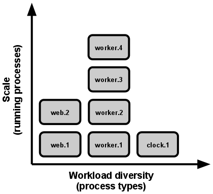
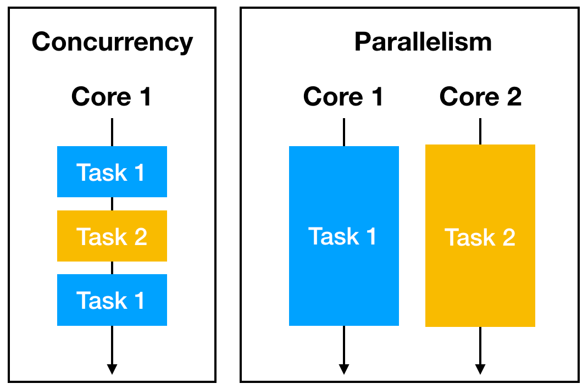

Scale out via the process model

In the twelve-factor app, processes are a first class citizen

I'm just getting this from the 12factor.net foe my referenace. 

    The process model truly shines when it comes time to scale out. The share-nothing, horizontally partitionable nature of twelve-factor app processes means that adding more concurrency is a simple and reliable operation. The array of process types and number of processes of each type is known as the process formation.

Here is the example:

Here is the another good example of concurrency and parallelism:

