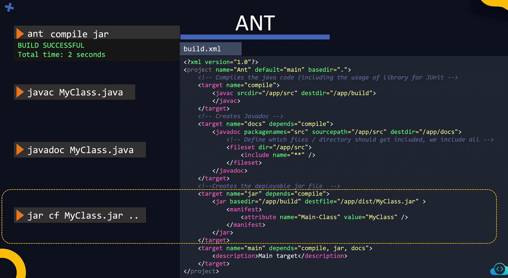

What is full form of JDK?

    Java Development Kit

Which java version is installed on 'host01' server?

````bash
thor@host01 ~$ java -version
openjdk version "11.0.20.1" 2023-08-24 LTS
OpenJDK Runtime Environment (Red_Hat-11.0.20.1.1-2) (build 11.0.20.1+1-LTS)
OpenJDK 64-Bit Server VM (Red_Hat-11.0.20.1.1-2) (build 11.0.20.1+1-LTS, mixed mode, sharing)
````

Which tool is used for documenting your app with JDK?

    Javadoc

Which tool is used for compiling your app with JDK?

    javac

Which tool is used for debugging your app with JDK?

    jdb

Which component was not part of JDK before version 9 of Java but became part of it from version 9 onwards?

    jre

Help us install Java 20 inside the /opt directory on the app01 server. Use the bob user and the password caleston123 to log in to the app01 server.

````bash
thor@host01 ~$ ssh app01
The authenticity of host 'app01 (172.16.238.15)' can't be established.
ED25519 key fingerprint is SHA256:Kr9ntpy03Sre775HNr03u8RDmq4QhRU8pDxHzuwDnTA.
This key is not known by any other names
Are you sure you want to continue connecting (yes/no/[fingerprint])? yes
Warning: Permanently added 'app01' (ED25519) to the list of known hosts.

thor@app01 ~$ sudo curl https://download.java.net/java/GA/jdk20/bdc68b4b9cbc4ebcb30745c85038d91d/36/GPL/openjdk-20_linux-x64_bin.tar.gz --output /opt/openjdk-20_linux-x64_bin.tar.gz
  % Total    % Received % Xferd  Average Speed   Time    Time     Time  Current
                                 Dload  Upload   Total   Spent    Left  Speed
100  188M  100  188M    0     0  84.9M      0  0:00:02  0:00:02 --:--:-- 84.9M

thor@app01 ~$ sudo tar -xf /opt/openjdk-20_linux-x64_bin.tar.gz -C /opt/
````

We need to set java binary path in environment PATH variable to use java binaries. So that you can simply run java instead of the full path.

Once done, verify that you can invoke java simply by running java command.

````bash
thor@app01 /opt/jdk-20/bin$ export PATH=$PATH:/opt/jdk-20/bin
````

## ANT




We have created MyClass.java file inside /opt/app directory. View it if you like using the command cat MyClass.java. Please compile it.

````bash
thor@host01 ~$ cd /opt/app
thor@host01 /opt/app$ javac MyClass.java
````

Generate documentation for the MyClass.java source code into the /opt/app/doc directory.

````bash
thor@host01 /opt/app$ javadoc -d doc MyClass.java
    Loading source file MyClass.java...
    Constructing Javadoc information...
    Creating destination directory: "doc/"
    Building index for all the packages and classes...
    Standard Doclet version 21.0.3+7-LTS-152
    Building tree for all the packages and classes...
    Generating doc/MyClass.html...
    Generating doc/package-summary.html...
    Generating doc/package-tree.html...
    Generating doc/overview-tree.html...
    Building index for all classes...
    Generating doc/allclasses-index.html...
    Generating doc/allpackages-index.html...
    Generating doc/index-all.html...
    Generating doc/search.html...
    Generating doc/index.html...
    Generating doc/help-doc.html...
````

Install the Apache Ant build tool on host01 server.

````bash
thor@host01 ~$ sudo yum install -y ant
````

Compile and generate jar package using ant.

````bash
thor@host01 ~$ cd /opt/ant/
thor@host01 /opt/ant$ ant compile jar
````
Install the maven build automation tool on the host01 server.

````bash
thor@host01 ~$ sudo yum install -y maven
````

Please compile and package the application inside /opt/maven/my-app/ with maven on host01 server.

````bash
thor@host01 /$ cd /opt/maven/my-app/
thor@host01 /opt/maven/my-app$ sudo mvn package
````